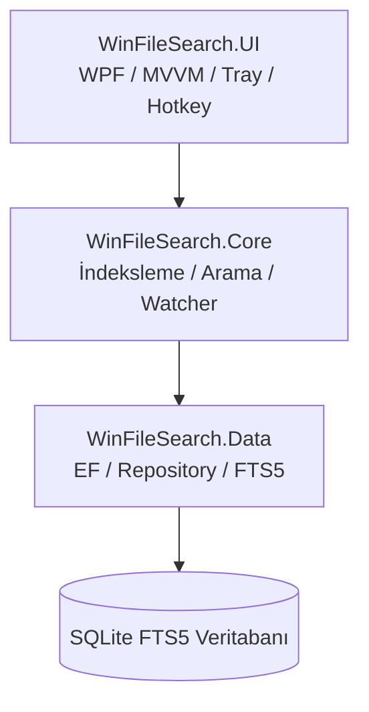

# WinFileSearch

<p align="center">
  
</p>

<p align="center">
  <b>Hızlı, Güçlü ve Modern Windows Dosya Arama Uygulaması</b>
</p>

<p align="center">
  
  
  
  
  
  
</p>

---

## 📖 Hakkında

**WinFileSearch**, bilgisayarınızdaki dosyalara milisaniyeler içinde erişmenizi sağlayan, modern ve yüksek performanslı bir masaüstü arama uygulamasıdır. Gücünü **SQLite FTS5 (Full-Text Search)** altyapısından alan uygulama, yüz binlerce dosya arasında bile anlık kısmi ve tam metin eşleşmesi sunar.

Arka planda gerçek zamanlı dosya sistemi izleme (**FileSystemWatcher**) sayesinde klasörlerinizdeki değişiklikler (yeni dosya ekleme, silme, güncelleme) anında indeks veritabanıyla senkronize olur.

---

## ✨ Öne Çıkan Özellikler

- ⚡ **Işık Hızında Arama** – SQLite FTS5 ve 300ms akıllı debounce ile siz yazarken takılmadan anında sonuç verir.
- 📁 **Çoklu Klasör İndeksleme** – Dilediğiniz klasörleri kolayca ekleyip çıkarın, arka planda UI donmadan indeksleyin.
- 🏷️ **Akıllı Kategori Filtreleri** – Tümü, Belgeler (*Documents*), Görseller (*Images*) ve Medya (*Media*) filtreleri arasında tek tıkla geçiş yapın.
- ⭐ **Favoriler & Arama Geçmişi** – Sık kullandığınız dosyaları yıldızlayarak favorilere ekleyin, geçmiş aramalarınıza hızlıca göz atın.
- ⌨️ **Global Kısayol (`Win + Shift + F`)** – Sisteminizin herhangi bir yerinden uygulamayı anında açın veya gizleyin.
- 📌 **Sistem Tepsisi (System Tray) & Otomatik Başlatma** – Windows başlangıcında arka planda sessizce çalışsın, sistem tepsisinden kolayca yönetilsin.
- 🌐 **Çoklu Dil Desteği (TR / EN)** – Türkçe ve İngilizce dilleri arasında dinamik ve anlık geçiş imkanı.
- 👁️ **Hızlı Önizleme (Quick Preview)** – Seçilen dosyanın konumu, boyutu, kategorisi ve son değiştirilme tarihlerini anında inceleyin.
- 🌙 **Modern Koyu Tema** – WPF ve MVVM mimarisiyle tasarlanmış, göz yormayan şık arayüz.
- 📝 **Kurumsal Loglama & Performans Takibi** – Serilog entegrasyonu ile kapsamlı loglama ve anlık bellek/arama metrikleri.
- 🔄 **Otomatik Güncelleme Desteği** – Uygulama içinden doğrudan GitHub sürüm kontrolü ve güncelleme olanağı.

---

## 📸 Ekran Görüntüleri

### Ana Sayfa


### Arama Sonuçları


### Ayarlar


---

## ⌨️ Klavye Kısayolları

| Kısayol / Eylem | Açıklama |
|---|---|
| `Win + Shift + F` | Uygulamayı herhangi bir yerden aç / gizle (Global Hotkey) |
| `Enter` | Seçili dosyayı varsayılan uygulamasıyla aç |
| `Çift Tıklama` | Dosyayı aç veya konumunu görüntüle |

---

## 🚀 Kurulum

### Gereksinimler
- Windows 10 veya Windows 11
- [.NET 8.0 Desktop Runtime](https://dotnet.microsoft.com/download/dotnet/8.0)

### 1. Hazır Sürüm İndirme (Önerilen)
[Releases](https://github.com/CevdetTufan/WinFileSearch/releases) sayfasından en güncel kurulum dosyasını (`.exe`) veya taşınabilir (`Portable ZIP`) sürümünü indirebilirsiniz.

> [!NOTE]
> **Windows SmartScreen Uyarısı:** Uygulama henüz ticari bir sertifikayla imzalanmadığından Windows ilk çalıştırmada uyarı verebilir. *"Daha fazla bilgi" (More info)* -> *"Yine de çalıştır" (Run anyway)* diyerek açabilir veya Portable sürümü tercih edebilirsiniz.

### 2. Kaynak Koddan Derleme

```powershell
# Projeyi klonlayın
git clone https://github.com/CevdetTufan/WinFileSearch.git
cd WinFileSearch

# Bağımlılıkları geri yükleyin ve derleyin
dotnet build

# Uygulamayı başlatın
dotnet run --project src/WinFileSearch.UI
```

---

## 📖 Kullanım Rehberi

1. Uygulamayı ilk kez açtığınızda **Settings (Ayarlar)** sekmesine gidin.
2. **Add Folder (Klasör Ekle)** butonuna basarak arama yapmak istediğiniz dizinleri belirleyin.
3. Arka planda hızlı indeksleme tamamlandıktan sonra **Search (Arama)** sekmesine geçin.
4. Arama kutusuna anahtar kelimenizi yazın; sonuçlar anlık olarak listelenecektir.
5. Dosyayı favorilere eklemek için yıldız ikonuna tıklayabilir, detay panelinden **Open Location (Konumu Aç)** ile klasöre gidebilirsiniz.

---

## 🏗️ Mimari ve Proje Yapısı

Proje, katmanlı **MVVM (Model-View-ViewModel)** mimarisine ve **Dependency Injection (DI)** prensiplerine uygun olarak geliştirilmiştir.

### Katman Akışı



### Detaylı Dosya Ağacı

```text
WinFileSearch/
├── src/
│   ├── WinFileSearch.Data/                # Veri ve Veritabanı Katmanı
│   │   ├── Models/                        # Varlık (Entity) modelleri (FileEntry vb.)
│   │   ├── Repositories/                  # Repository tasarım deseni
│   │   └── FileSearchDbContext.cs         # SQLite & FTS5 (Full-Text Search) bağlamı
│   │
│   ├── WinFileSearch.Core/                # Çekirdek İş Mantığı Katmanı
│   │   ├── Interfaces/                    # Servis sözleşmeleri (IFileSearchService vb.)
│   │   ├── Models/                        # DTO modelleri ve filtre tanımları
│   │   └── Services/                      # İndeksleme, Arama, Watcher ve Güncelleme servisleri
│   │
│   └── WinFileSearch.UI/                  # Kullanıcı Arayüzü (WPF) Katmanı
│       ├── ViewModels/                    # MVVM ViewModels (Home, Search, Settings)
│       ├── Views/                         # XAML pencereleri ve arayüzler
│       ├── Services/                      # Hotkey, Tray, Dil, Loglama, Favori servisleri
│       ├── Themes/                        # Koyu tema ve stil tanımları
│       └── Resources/                     # Çoklu dil dosyaları (TR/EN) ve ikonlar
│
├── installer/                             # Inno Setup Kurulum Komut Dosyası (.iss)
├── docs/                                  # Ekran Görüntüleri ve Görsel Varlıklar
├── PLAN.md                                # Proje Yol Haritası ve Geliştirme Planı
└── README.md                              # Ana Dokümantasyon
```

---

## 🛠️ Kullanılan Teknolojiler

| Teknoloji / Kütüphane | Kullanım Amacı |
|---|---|
| **.NET 8.0 & WPF** | Modern Windows masaüstü arayüzü ve uygulama platformu |
| **SQLite + FTS5** | Yüksek hızlı tam metin (Full-Text) indeksleme veritabanı |
| **CommunityToolkit.Mvvm** | MVVM tasarımı, ObservableObject ve RelayCommand altyapısı |
| **Microsoft.Extensions.DI** | Dependency Injection (Bağımlılık Enjeksiyonu) yönetimi |
| **Serilog** | Dosya tabanlı ve yapılandırılmış kurumsal loglama |
| **Inno Setup** | Windows yükleyici (`.exe`) paketi hazırlama |

---

## 📊 Performans Metrikleri

| Metrik | Değer |
|---|---|
| **İndeksleme Hızı** | ~10.000+ dosya / saniye |
| **Arama Süresi** | < 50 milisaniye (100.000+ dosya arasında) |
| **Bellek Tüketimi** | ~50 – 100 MB |
| **Veritabanı Boyutu** | ~1 MB / 10.000 dosya |

---

## 🤝 Katkıda Bulunma

Katkılarınızı memnuniyetle karşılıyoruz! Yeni özellik eklemek veya hata düzeltmek için:

1. Bu depoyu çatalayın (**Fork**).
2. Yeni bir özellik dalı oluşturun (`git checkout -b feature/yenilikci-ozellik`).
3. Değişikliklerinizi işleyin (`git commit -m 'feat: Yenilikçi özellik eklendi'`).
4. Dalınızı uzak depoya gönderin (`git push origin feature/yenilikci-ozellik`).
5. Bir **Pull Request** açın.

---

## 📝 Lisans

Bu proje **MIT Lisansı** altında lisanslanmıştır. Daha fazla bilgi için [LICENSE.txt](LICENSE.txt) dosyasına göz atabilirsiniz.

---

## 👤 Geliştirici

**Cevdet Tufan**
- GitHub: [@CevdetTufan](https://github.com/CevdetTufan)

---

<p align="center">
  ⭐ Projeyi faydalı bulduysanız yukarıdan yıldız vermeyi unutmayın!
</p>
